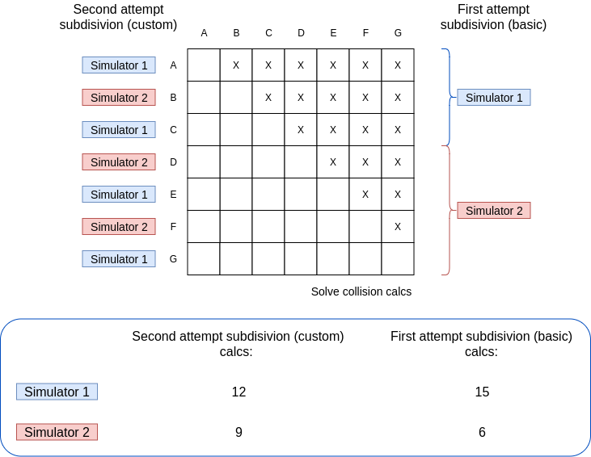

# Particle Collision Simulator
*Authors:
[Paolo Baldini](https://github.com/Mandrab),
[Ylenia Battistini](https://github.com/yleniaBattistini)*

The project, developed for the *Concurrent and Distributed Programming* course at University of Bologna, is about the development of a multi-threaded particle collision simulator. 
The aim of this project was a better comprehension of how a multi-threaded system can work. The implementation indeed need the use of some form of synchronization. For the project, the *cyclic-barriers* construct has been used and some other constructs like semaphores and monitors were considered.
  
**Disclaimer:** we know that the MVC pattern has not been stictly implemented (the thread in the model section aren't the best solution). The cause of that design choice is that we believe that not separing interaction mechanism from update logic could, in this specific case, improve the clarity of the system (we want to remind you that this is only a case study).

# TODO PLAY

## The simulator
The simulator simulates the collision of some particles with some speed and direction. When a collision occours, the particles 'bounce' changing direction and speed according to the previous values of the particles considered. 
Beeing the goal of the project to improove knowledge about the multi-threaded interaction, no effort was put on making the balls not override at creations. Thus that, playing the system some particles could be created overriding each other. This aspect does not change the general behaviour of the system but only influences some implementation details.

## System structure and behaviour
Below, some *Petri nets* describing the general structure/architecture and behaviour of the system are shown. We want to underline that these are a simplified version of a Petri net drawn with the goal of show in a clear way how the system's components interact. Thus that, some of the transition include some 'conditions' that made the net impossible to be automatically run by a net-simulator. We hope however that these ones can make the system's structure and behaviour clearer.

# TODO PETRI NET

## Java Pathfinder
To check the system ability to provide some *safety* and *fairness* properties, the [Java Pathfinder](https://github.com/javapathfinder/jpf-core/wiki) tool has been used. This one has been used to check both the basic behaviour and the start/stop/step behaviour generated through user inputs.

## Some obtimization strategies
Developing the project, some efforts have been put into the obtimization of the execution speed.

### Collision array
This implementation detail has been introduced to reduce 'lock-gain' operations during collisions resolve. The concept is that a list of colliding entities is made for each particle. Knowing the list of colliding particles, allow us to gaining lock on the first particle only a time (we can then gain lock on each colliding entities) instead of gaining *two* locks every time a collision is found. 
That solution allow to make only *2n + 2* lock and unlock operations (1 lock and 1 unlock for each collident plus only a lock and unlock for the first particle) instead of *4n* operations (1 lock and 1 unlock for the first particle is executed at *every* collision found). 
Moreover, the collision array is structured as a lightest possible array in the hope to be left in cache by the system.

## Bodies subdivision
In the first try we used index range to divide particles updates jobs. That solution however, led the first simulator to execute an incredibly greater quantity of calcs to respect of the last one (see figure below). 
A solution has been found implementig two different subdivision strategies. These ones aim to divide the particles responsibility between the simulators in an more equal way. 
Not entering in a formal description, the basic idea is cleary represented by the image below. Regarding the change in quantity of calcs however, the new solutions lead to a different quantity: with two simulators of index *i*, *j* and *c* the quantity of bodies for simulator, whe get *c (j - i)* differences of calcs between the two. Before these strategy to be implemented, the difference of calcs was *c^2 (j - i)*.

